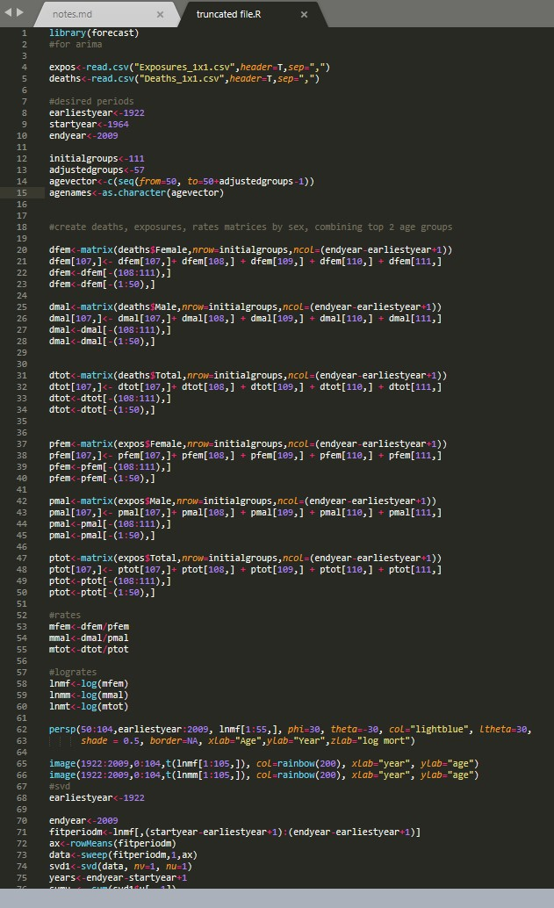

class: inverse, center, middle

# About this workshop

---
# Aims


The aims of this workshop are to:

1. Introduce a number of concepts that aid the development of an understanding of functions in R

2. Equip you to write functions to carry out arbitrary tasks

3. Provide guidelines for function writing in R

4. Introduce approaches to functional programming in R


---
# Schedule

We will discuss three basic topics, grouped into three 'lectures':

1. Function Basics

2. Principles of Function Writing

3. Functional Programming


---
# Prerequisites

- Basic knowledge of R
  + Data structures (vectors, lists, dataframes)
  + For Loops
  + If statements
- No prior knowledge of functions

> We will therefore start slowly


--
Many examples in the slides will be intentionally simple 

- To illustrate the principles in question

- To avoid relying on disciplinary knowledge that not all participants will have!


---
# Acknowledgements

This course builds on material from a variety of sources:

> *Writing Scientific Software* by Suely Oliveira and David Stewart, CUP
 
 
> *Advanced R* by Hadley Wickham, (2nd Edition), CRC press
 

> *Clean Code* by Robert C. Martin, Prentice Hall
 

> Resources from *Software Carpentry*
 

> Documentation from base R and R packages `purrr`, `dplyr`, `tidyr`,  and `magrittr`


---
class: inverse, center, middle

# Motivations


---
# What are Functions?

A function is a collection of **instructions** for performing a particular task.

Functions *typically* involve these elements:

--
### Arguments
> A function may have *arguments* (inputs) upon which it operates.


--
### Body
> A function will have a *body* which describes the computations that the functions must carry out


--
### Return Value
> A function may have a *return value* (output) that gives the result of computations


---
# A Simple Analogy

In mathematics and statistics, we also have the concept of a function.

A mathematical function can be thought of as a transformation:


$y = f(x)$


--
Consider the familiar function below:

$$
f(x) = x^2
$$

In this case we have a function with an *argument* $x$  and an *output* of $x^2$.


--
We can evaluate this function for specific values of the argument:

$$
\begin{aligned}
f(2) = 4 \\
f(3) = 9 \\
\vdots
\end{aligned}
$$

Notice we have a distinction between the symbolic argument ( $x$ ) we use to describe the function and the value it takes in particular cases ( $2,3, \dots$ ).


---
# A Caveat

Not all programming functions have arguments and outputs.


### No outputs
Some functions are used mainly for their **side effects**:

--
- Plotting functions
  + An example in R is `plot`
- Printing functions 
- I/O (Input / Output) functions
  + For instance, saving files to disk


### No inputs

Other code may not have (explicit) inputs.


--
- Functions that tell us something about the state of our system
- An example you might be familiar with in R is `getwd`


---
# Why Write Functions?

.pull-left[
What looks wrong with the code on the right?

- *This is code I wrote ~10 years ago*

- *Don't worry about the code itself, but focus on what you can tell by looking at it*

- *Note that the purple colour indicates raw numbers* 

] 
.pull-right[


]

---
# Why Write Functions?

Functions are a vital part of writing **robust** and **reusable** scientific code.


How do functions help us?


--
Functions:

- Prevent replication


- Allow particular aspects of code behaviour to be easily changed


- Allow the reuse of pieces of code in other contexts


- Serve as the building blocks for packages

- Break your code down into units that can easily be debugged, tested, and altered


---
class: inverse, center, middle

# Functions in R


Much of this content is adapted from: 


*Advanced R* by Hadley Wickham, (2nd Edition), CRC press

This content is  available under a Creative Commons License:
[http://creativecommons.org/licenses/by-nc-sa/4.0/](http://creativecommons.org/licenses/by-nc-sa/4.0/)

---
# Functions in R

Let's take a look at a trivial function in R that you are unlikely to write in practice:

```{r}
square <- function(x){
  y <- x ** 2 
  return (y)
}
```


--
To create a function:
- We use the keyword `function` to let R know what follows is a function definition


- We include the **arguments** of a function between parenthesis directly after the function keyword
  + Multiple arguments are separated by commas
  
  
- We include the **body** of the function within curly braces `{}`


- We can include a **return** statement to specify what the function should output


---
# Return statements

Return statements are optional in R.


--
If no return statement is provided, a function will return the result of the last bit of R code in its body

We can therefore rewrite our previous function:

```{r}
square <- function(x){
  x ** 2
}
```


--
The choice of whether to include `return` is really one of personal preference; both are equally valid.


> I prefer to use `return`, because it is explicit and makes code easier to read.
  - It is then easier to scan scripts and distinguish functions from other statements in curly braces (e.g. `if` statements).


---
# Calling functions in R


Once our function has been *created*, we can *use* a function by writing the function name, followed by the argument you wish to provide to it enclosed in parentheses:

```{r}
square(2)
```

This is known as **calling** the function.


--
- We can reuse functions as many times as we like

- We can provide whichever arguments we desire to them

```{r}
square(42)

square(11)
```

---
# Components of R functions

R functions consist of three components.


--
The **formals** or arguments to the function:

```{r}
formals(square)
```


--
The **body** of the function:
```{r}
body(square)
```


--
The **environment** of a function (which will require more explaining!):


```{r}
environment(square)
```

---
# Primitive Functions

Before we move on, we should note that many built-in functions in R have a slightly different character.


--
This is because they are consist not of R code, but of an interface to underlying `C` functions.

- `C` is a compiled programming language
  + This means user-written code is turned into a lower-level set of computing instructions and optimised in advance
  + `C` is much faster than pure R code
  + It is also more difficult to read and write


R functions that call `C` code directly are called **primitives**

- They are irreducible, fundamental building blocks of the language.


---
# Variables and names in R
In order to understand what the environment of a function does, we need to first understand a little more about assignment in R.

Imagine we type the code below into the R console:


```{r}
a_vector <- c(10,4,3,7)

```


This code creates an R object consisting of a vector of integers, and assigns the name `a_vector` to this object.


### The Global Environment

This name is contained within R's 'global environment'

When we subsequently type the name `a_vector` into the console, the name `a_vector` is looked up in the global environment, and the object associated with it is retrieved.


---
# Try it


Try running the code below.


```{r, eval=F}
library(rlang)
a <- 453
rlang::env_print()
```


You may need to install the `rlang` package if you don't have it already.

```{r,eval=F}
install.packages("rlang")
```


---
# Environments and functions

R sessions can have more than just the global environment.


--
An environment serves as a container for a set of names assigned to particular R objects.


--
Each function has an enclosing environment - the environment in which it is created

- For the function `square` we created above, we saw that the enclosing environment was the global environment


```{r}
environment(square)
```


> This will become more important later on

---
# What happens when you call a function?

Our understanding of functions is helped by understanding what happens when a function is called.

.pull-left[

- When a function is called, an *execution environment* is created

- Values supplied as arguments are assigned within the execution environment

- Computations are carried out and any local variables are assigned

- The function output is returned and the **execution environment is destroyed**

]

.pull-right[

```{r, error=TRUE}
mean_1 <- function(x){
  sum_of_x <- sum(x)
  n <- length(x)
  return(sum_of_x / n)
}

mean_1(c(2,3,5,6,7))

print(n)
```
]


--
> Variables local to a function are no longer available once a function has returned

---
# Scoping

Scoping describes the process of looking up the value associated with a name. R method is known as `Lexical Scoping`:

- If a name is reference inside a function, to find it's value, R will first look inside the execution environment
- If the variable referenced is not found, it will look inside the enclosing environment
- If the variable is still not found, any 'higher' environments will also be checked untill the global environment is reached


The example below demonstrates this in action. 
What value will it return?
```{r, eval=F}
x <- 10 

multiply <- function(y){
  x <- 40
  y * x
}

multiply(2)
print(x)
```


---
# Dynamic Scoping

What value will the code below return?
```{r, eval=F}
x <- 10 

multiply <- function(y){
  y * x
}

x <- 20

multiply(2)
```


---
# Functions as objects

Functions in R are objects, just as other vectors and dataframes are.


--
- In many respects, they behave in the same way as other R objects


Creating a function is similar to creating a new variable
```{r}

a <- 4
b <- function(x){
  return (x + 1)
}

rlang::env_print()


```


---
# Functions as objects
We can store functions in lists and iterate over them, for example:

```{r}

x <- rnorm(1000)

functions <- list(summary_1 = mean, summary_2 = median)

for (func in functions){
  print(func(x))
}

```


---
# Function Factories

A consequence of this is that we can also return a function from another function, and provide functions as arguments to other functions.


--
An application of this is when we want to write more than one function carrying out the same calculations on different data or parameters:

```{r}

make_adder <- function(y){
  adder <- function(x){
    return(x + y)
  }
  return(adder)
}

add_10 <- make_adder(10)
add_4 <- make_adder(4)

c(add_10(1), add_4(3))

```

**Q** What is the enclosing environment of the function `add_4`?


---
# Lazy Evaluation

Functions evaluate arguments **lazily**. 

What does this mean? 

- Arguments to functions will only be evaluated when they are referred to in the body


```{R}
lazy_function <- function(x=rnorm(1e34534564)){
  return("yawn")
}

lazy_function()
```


---
# Default Arguments

Some functions will have arguments we will only want to change occasionally.

- We can provide **default arguments** which will be used if the are not specified when the functions is called.


--
Example:
```{r}

get_surname <- function(name, splitting_character=" "){
  surname <- strsplit(name, split=splitting_character,)[[1]][2]
  return(surname)
}
get_surname("jason hilton")

get_surname("jason/hilton", "/")

```


If splitting character is not specified, the default value is used.

---
# Matching Arguments 

We might want to restrict the users of our function to arguments coming from a set of specific values.

We can do this using `match.args`:

```{r, error=TRUE}
get_surname2 <- function(name, splitting_character=c(" ", "/")){
  match.arg(splitting_character)
  surname <- strsplit(name, split=splitting_character,)[[1]][2]
  return(surname)
}

get_surname("Jason Hilton", "a")
get_surname2("Jason Hilton", "a")

```


---
# Dots ... 

Another important tool concern cases when we don't know how many arguments we will get when we are writing a function.

Here we can use the elipsis (`...`) to indicate to refer to a list of any additional arguments passed to the function.

```{R}
invert <- function(x, ...){
  dots <- list(...)  
  out <- c()
  for (item in dots){
    out <- c(out, 1/item)
  }
  return(out)
}
```

```{r}
invert(23,4,5,6)

invert(23,4,5,6,5,7)
```

(In reality we would just use a vector to do this!)

---
# Summary 

During this session we have:


- Defined some key terms:
  + Function
  + Argument
  + Body
  + Environment
  + Primitive Function
  
- Understood what happens when a function is called

- Learned some tools to help us write better functions
  + Default arguments
  + Argument matching
  + Function factories

